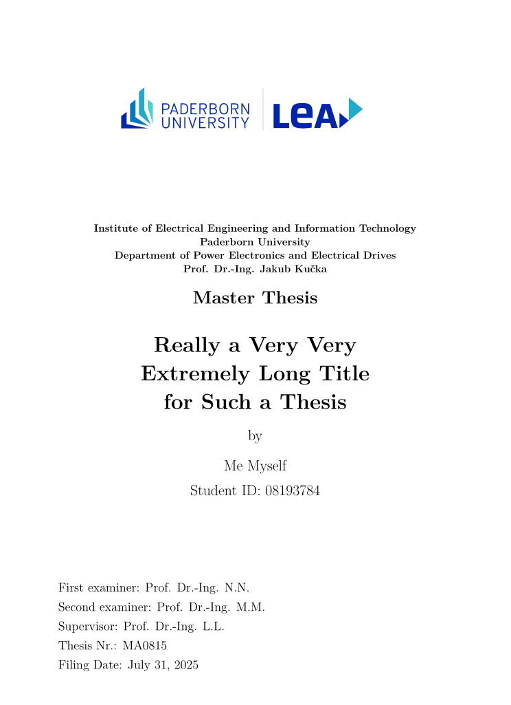

# thesis_latex_template
This is a latex document template for LEA students, writing a project report a thesis or a dissertation.

## Using the template
Run `main.tex` using an LaTeX editor, e.g. TexStudio.

### Overleaf
Create a new Project by importing the ZIP file from the GitHub release section (see right side on this page)!

Set the main document :
`Menu` -> `Main Document` -> `main.tex`

### TeXstudio
 * Prefer to use `Latexmk`, as this will also build the glossary section, acronym section and nomenclature section
 * The compiler `PdfLaTeX` also works, but does not show the mentioned sections

Change the bibliography program to `Biber`
`Options` -> `Configure TeXstudio` -> `Generate` -> default bibliography program: `Biber`

## Using own packages
Do not modify the `.cls` file. Add onw LaTeX packages into the `chapters/header.tex`-file.

## Preview

## Information for Linux users

### Installation
You might need to install some packages from the repositories. Arch Linux example here:
 * texlive-langgerman (in case of using the german language)
 
### Clean up auxiliary files
Run the shell script `clean_temp_data.sh` in the subfolder to clean up all auxiliary files with one command.

### Troubleshooting
 * The glossary also requires `texlive-binextra` (Arch Linux)

## Notes:
 * Use `latexmk` as compiler to build `Acronyms`, `Glossary` and `Nomenclature` sections
 * `.latexmkrc` (Linux) / `latexmkrc` (Windows) is for the glossary and should not be removed 
 * for creating PDF/A files, see [this example code](https://www.overleaf.com/latex/templates/creating-pdf-slash-a-and-pdf-slash-x-files-with-the-pdfx-package/bbbycnbyqhnm). 
 * In dissertation mode, to distinguish between own and other literature, the keyword `ownliterature` must be added to your own contributions in the `.bib` file. The keyword must be the only one.
 * In case of your LaTeX kernel ist too old and needs an upgrade, use this [hints](https://tex.stackexchange.com/questions/55437/how-do-i-update-my-tex-distribution/55473#55473).
 * `pearl` is required, [see also](https://miktex.org/kb/fix-script-engine-not-found).
